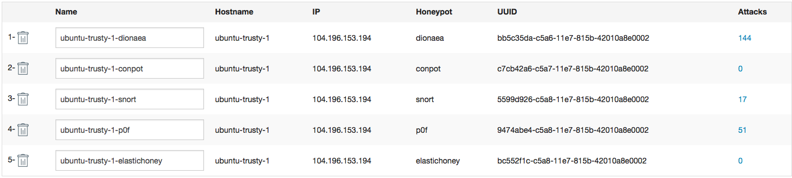
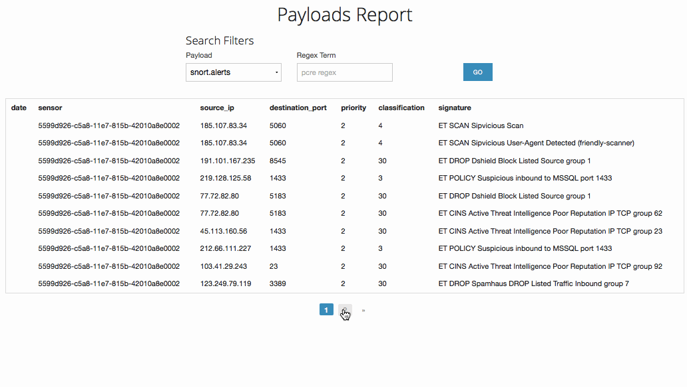

# web-security-week-9

## Which Honeypot(s) you deployed

## Any issues you encountered
- some instructions from codepath had caused me in error until I figured out for a long time.

## A summary of the data collected: number of attacks, number of malware samples, etc.

## Any unresolved questions raised by the data collected
 - None
